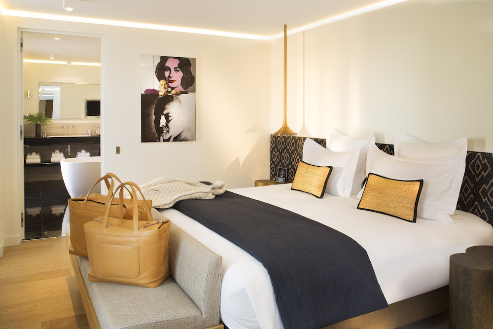

# Projet-Front-end-Hotel-Cop
Réalisation d'un site Front dans le cadre de ma formation "Développeur Intégrateur Web" au sein d'IFOCOP

<!DOCTYPE html>
<html lang="fr">

<head>
  <!-- Required meta tags -->
  <meta charset="utf-8">
  <meta name="viewport" content="width=device-width, initial-scale=1">
  <meta name="author" content="Grégory et Menelik">

  <!-- Bootstrap CSS -->
  <link rel="stylesheet" href="https://stackpath.bootstrapcdn.com/bootstrap/4.2.1/css/bootstrap.min.css"
    integrity="sha384-GJzZqFGwb1QTTN6wy59ffF1BuGJpLSa9DkKMp0DgiMDm4iYMj70gZWKYbI706tWS" crossorigin="anonymous">
  <!-- Google Fonts -->
  <link href="https://fonts.googleapis.com/css?family=Roboto" rel="stylesheet">
  <link href="https://fonts.googleapis.com/css?family=Cinzel&display=swap" rel="stylesheet">

  <link rel="stylesheet" href="https://use.fontawesome.com/releases/v5.6.3/css/all.css"
    integrity="sha384-UHRtZLI+pbxtHCWp1t77Bi1L4ZtiqrqD80Kn4Z8NTSRyMA2Fd33n5dQ8lWUE00s/" crossorigin="anonymous">

  <!-- Date range picker CSS-->
  <link rel="stylesheet" type="text/css" href="https://cdn.jsdelivr.net/npm/daterangepicker/daterangepicker.css" />

  <!-- CSS perso-->
  <link rel="stylesheet" type="text/css" href="css/index.css">
  <title> Accueil - HotelCop</title>
</head>

<body>

  <!--Menu -->
  <nav id="menu" class="row navbar navbar-expand-lg navbar-dark bg-light">
    
    <button class="navbar-toggler" type="button" data-toggle="collapse" data-target="#navbarSupportedContent"
      aria-controls="navbarSupportedContent" aria-expanded="false" aria-label="Toggle navigation">
      
    </button>

    

      <ul class="navbar-nav mr-auto">
        <li class="nav-item">
          <a class="nav-link" href="actus.html">Actualités</a>
        </li>
        <li class="nav-item">
          <a class="nav-link" href="presentation.html">Présentation</a>
        </li>
        <li class="nav-item">
          <a class="nav-link" href="chambre.html">Chambres</a>
        </li>
        <li class="nav-item">
          <a class="nav-link" href="restaurant.html">Restaurant</a>
        </li>
        <li class="nav-item">
          <a class="nav-link" href="spa.html">SPA</a>
        </li>
        <li class="nav-item">
          <a class="nav-link" href="avis.html">Avis</a>
        </li>
        <li class="nav-item">
          <a class="nav-link" href="acces.html">Accès</a>
        </li>
        <li class="nav-item">
          <a class="nav-link" href="events.html">Évènements</a>
        </li>
      </ul>

      <a href="panier.html"><i class="fas fa-shopping-basket text-light"></i></a>
      <button type="button" class="btn btn-link langue col-xs-12"></button>
      <button type="button" class="btn btn-link langue col-xs-12"></button>
      <a class="btn btn-primary col-xs-12" href="#" role="button" id="book">Reservation</a>

      <form class="form-inline my-2 my-lg-0 d-none d-sm-block">
        

          <input type="text" class="form-control" placeholder="Rechercher">
          

            <button class="btn btn-outline-light my-2 my-sm-0" type="submit"><i class="fas fa-search"></i></button>
          

        

      </form>
    

  </nav>

  <!--Menu FIN-->

  

    <!--Slider -->
    

      <ol class="carousel-indicators">
        <li data-target="#slider" data-slide-to="0" class="active"></li>
        <li data-target="#slider" data-slide-to="1"></li>
        <li data-target="#slider" data-slide-to="2"></li>
      </ol>
      

        

          
          

        

        

          
          

        

        

          
          

        

      

    

  

  <!--Slider FIN-->

  <!--contenu -->
  

    

      <blockquote class="col-12 blockquote text-center">
        <h1 class="mb-0">L’HOTELCOP : UN HÔTEL D’EXCEPTION A PARIS 8</h1>
        <footer class="blockquote-footer"><cite>“Votre résidence parisienne HôtelCop offre une vue imprenable sur la
            Tour Eiffel et tous les monuments célèbres de Paris."</cite></footer>
      </blockquote>
       
      <blockquote class="col-12 blockquote text-center">
        

          L’HôtelCop, idéalement situé dans le 8ème arrondissement de Paris entre l’avenue Montaigne,
          les Champs Elysées et l’avenue George V, offre de magnifiques chambres et suites spacieuses avec vues pour
          certaines sur la Tour Eiffel ou les toits parisiens.
        

         
         
        

          En plein cœur du triangle d’or de Paris, l’HôtelCop constitue le point de départ idéal pour découvrir la
          capitale.
          A proximité de cet hôtel 5 étoiles, se trouvent de nombreux intérêts et monuments touristiques comme le Grand
          Palais, l’arc de triomphe, le musée du Quai Branly ou la Tour Eiffel.
        

      </blockquote>
       
       
       
    

    

      

        

          <h3 class="italic"> UN RAFFINEMENT PARISIEN</h3>
           
          

            L'HôtelCop 5 étoiles, vous accueille dans une demeure historique de 45 chambres et 5 suites, entièrement
            revisitée par André Warhall 2019 et pour l'inauguration février 2020
          

           
           
          <a href="reservation.html" class="gold">RESERVER</a>
        

        

          
        

      

    

    

      

        

          
        

        

          <h3 class="italic">AU COEUR DU TRIANGLE D'OR</h3>
           
          

            Situé au centre du 8ème arrondissement entre l'Avenue Montaigne, les Champs Elysées et l'Avenue George V,
            l'élégance parisienne s'exprime dans toute sa quintessence.
          

           
           
          <a href="chambre.html" class="gold">EN SAVOIR PLUS</a>
        

      

    

    

      

        

          <h3 class="italic">SERVICE SUR-MESURE</h3>
           
           
          

            Une maison sur la Rive Droite, où se reposer de Paris le temps d'un séjour sur mesure, d'un repas, d'un
            verre
            ou d'une projection. Le décor raffiné, la qualité du service, dont possibilité d'avoir une voiture avec un
            chauffeur, la localisation exceptionnelle de l'hôtel vous permettront de profiter pleinement de votre visite
            à
            Paris.
          

           
           
          <a href="#" class="gold">EN SAVOIR PLUS</a>
        

        

          
        

      

    

    

      

        

          
        

        

          <h3 class="italic">CHAMBRES & SUITES</h3>
           
          

            L'HôtelCop propose 45 chambres repartie en 4 catégorie : la chambre classique, la chambre Confort, la
            chambre
            Deluxe et nos Suites. Certaines de nos chambres s'adaptente pour les familles, en vous offrant des espaces
            jusqu'à 4 personnes.
            Certaines de nos suites disposent d'une terrase avec vue sur la Tour Eiffel et Paris.
          

           
           
          <a href="chambres.html" class="gold">EN SAVOIR PLUS</a>
        

      

    

    

      

        

          <h3 class="italic">NOTRE RESTAURANT</h3>
           
          

            Poussez les portes de ce lieu discret à l'écart de l'effervescence des Champs-Elysées et plongez dans une
            ambiance feutrée et cosy.
             
            Ayez le plaisir de découvrir notre carte du monde qui évolue à mesure des saisons & qui offre un choix des
            meilleures fondamentaux gastronomiques.
          

           
           
          <a href="restaurant.html" class="gold">CARTE DU RESTAURANT</a>
        

        

          
        

      

       
    

    

      

        

          
        

         

        

          <h3 class="italic">NOTRE SPA</h3>
           
          
            Un instant de détente avec un soin aux huiles essentielles après un long voyage...
            

            Le SPA d'HôtelCop a un petit quelque chose en plus. Sans doute parce nous avons choisi de confier votre
            détente aux plus grands noms du bien-être et de la beauté.
             
            Pensez à réserver vos séance de SPA en même temps que votre séjour
          
           
          

          <a href="spa.html" class="gold">EN SAVOIR PLUS</a>
        

      

    

  

   

  <!--contenu fin-->

  <!--FOOTER-->
  

    

      
       
      1 RUE AVENUE MONTAIGNE,75008 PARIS, FRANCE
        +33 (0)1 70 98 78 88
      
 ©Hotelcop, Paris 2020

    

    

      

        SUIVEZ NOUS  
         
        <a href="https://fr-fr.facebook.com/HotelMarignan" target="_blank"><i
              class="fab fa-facebook-f"></i></a>
        <a href="https://www.instagram.com/hotels.barriere/?hl=fr" target="_blank"><i
              class="fab fa-instagram"></i></a>
        <a href="https://twitter.com/ghpalaisroyal?lang=fr" target="_blank"> <i
              class="fab fa-twitter"></i></a>
        <a href="https://www.youtube.com/hilton" target="_blank"> <i
              class="fab fa-youtube"></i></a>
      

    

    

      

        NEWSLETTER  
        <form action="nl.html">
          

            

              @
            

            <input type="text" class="form-control" placeholder="Saisissez votre email" aria-label="Email"
              aria-describedby="addon-wrapping">
            <a class="btn btn-primary col-xs-12" href="nl.html" role="button" id="valide">OK</a>
          

        </form>
        
En cliquant sur "OK", vous acceptez de recevoir
          des informations sur les nouvelles, les événements, les promotions et les services de l'hôtel.

      

    

    

      

        

          <a href="contact.html" class="col-md-12 col-lg-6 footer_end">CONTACTEZ-NOUS</a>
          <a href="recrutement.html" class="col-md-12 col-lg-6 footer_end">RECRUTEMENT</a>
        

        

        

          <a href="presse.html" class="col-md-12 col-lg-6 footer_end">PRESSE</a>
          <a href="mentionslegales.html" class="col-md-12 col-lg-6 footer_end">MENTIONS LEGALES</a>
        

        

        

          <a href="CGV.html" class="col-xs-6 col-md-12 col-lg-6 footer_end">CGV</a>
          <a href="sitemap.html" class="col-md-12 col-lg-6 footer_end">PLAN DU SITE</a>  
          <a href="#" class="col-xs-6 col-md-12 col-lg-6 footer_end vcenter"
            onclick="window.print(); return false;">Imprimer la page</a>
        

      

    

  

  

    
  

  
  <!--FOOTER FIN-->

  <form action="reservation.html" method="get" id="send_dates">
    <input type="hidden" name="starting_date" id="starting_date">
    <input type="hidden" name="ending_date" id="ending_date">
  </form>

  <!-- Optional JavaScript -->
  <!-- jQuery first, then Popper.js, then Bootstrap JS -->
  
  
  

  <!-- Liens JS pour le calendrier (Datarangepicker) -->
  
  

  

</body>

</html>
